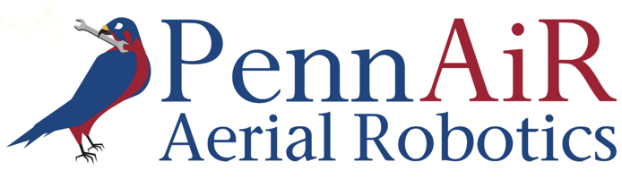

# Readme File

Answer the following questions after you have completed your coding challenge. Please be truthful in your responses. Remember we are looking for commitment and willingness to learn, not previous knowledge, so don’t get discouraged if you’re having trouble. You have done the hard work already, so be clear, yet brief in your answers.

# Questions

1. **How far did you get with the challenge? How much time did it take?**

I completed the challenge. The challenge took ~6 hours in total, although that was partly due to the fact that I haven't used Python in almost a year.

2. **Please provide a brief description of the way that you have organized your code.**
    
The cost of most efficient tour = 13358.7955682

The path of the most efficient tour = [0, 3, 4, 5, 6, 7, 8, 9, 10, 11, 12, 13, 2, 1, 0]

Time taken: <0.4 sec; time complexity O(n^2 * 2^n)

I organized my code question by question for the most part, putting generalizable blocks like TSP and distance in methods.

3. **Please provide instructions on how to run your code.**

Python 3.9.2, install json, geopy, and matplotlib if not installed.

4. **Is there any other relevant information that would be helpful for us to know?**

Let me know if you need any other information! What PennAIR's software team does is extremely interesting to me so I hope I get in :)